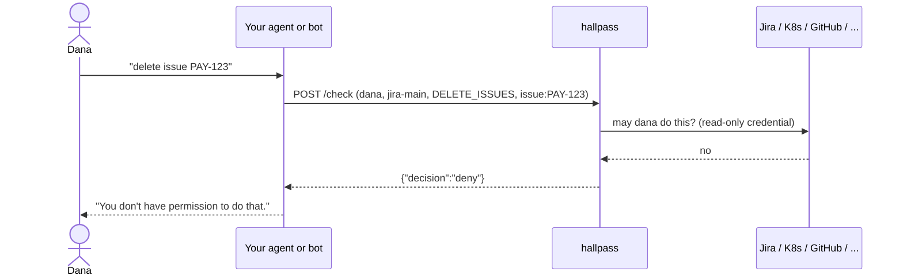

# hallpass

[](https://github.com/roee-hersh/hallpass/actions/workflows/ci.yaml)
[](https://goreportcard.com/report/github.com/roee-hersh/hallpass)
[](LICENSE)

**Permission checks for AI agents and bots, answered live by the system they act in.**



hallpass is a small self-hosted service that answers one question:

> May user X do action Y on resource Z in system C?

Other apps and AI agents act in third-party systems (Jira, GitHub, Kubernetes, ...) with their own
bot credentials, which can usually do more than the person who asked. Before acting, the app asks
hallpass. hallpass asks the third-party system live, with its own read-only credential, and answers
`allow`, `deny` or `unknown`. It only checks. It never performs the action.

## Why

An AI agent or chat bot usually holds one powerful service account. When Dana asks it to delete a
Jira issue or scale a deployment, the bot can, even when Dana could not. Copying every system's
permission model into your own policy engine drifts out of date the day you write it.

hallpass asks the source of truth instead: Kubernetes `SubjectAccessReview`, Jira's permission API,
GitHub collaborator roles, AWS IAM policy simulation, and so on. One API, twenty-one systems, no
synced copy of anyone's permissions.



- **Read-only.** It only checks and never performs the action.
- **Fails closed.** Anything it cannot evaluate is `unknown`, not `allow`.
- **Single static binary.** One YAML file and one dependency (`yaml.v3`). No database.

## Security model

hallpass treats the agent as an **untrusted deputy**: what the agent's own credential can do never
decides anything. The rules, and where each is enforced:

- **The user comes from your session, never from the model.** The caller of `/check` is your agent's
  tool layer, and it passes the user it authenticated (the Slack user, the SSO session). Bind it when
  the tools are built, as the [agent examples](examples/agent/) do; never let the model supply it as a
  tool argument.
- **Checked at the tool gateway.** The check runs in the tool wrapper before the call. The action runs
  only after an `allow`.
- **Fails closed.** `deny`, `unknown`, and any failure to reach hallpass all mean the tool does not
  run. hallpass answers `unknown` whenever it cannot evaluate, and never guesses.
- **Per resource, from the source of truth.** Each check names one resource (`issue:PAY-123`,
  `namespace:payments`) and is answered live by the system that owns it, with a read-only credential.
- **Every decision is logged** as a JSON line: user, connection, action, resource, decision, reason,
  whether it came from the cache, and the evidence: the upstream calls the decision was based on,
  each with its ETag or a hash of the response. See [Decision log](#decision-log).

Not goals, on purpose:

- **Human approval.** For destructive actions, add a confirmation step in the agent *after* an `allow`.
- **Atomicity.** It is a check before the action, not a transaction; permissions can change in
  between. Answers are cached for 30 seconds by default (`decision_cache_seconds: 0` disables it);
  a check with `"fresh": true` skips the caches and asks the upstream system now, which narrows
  the window but does not close it.
- **Proving who the user is.** hallpass answers "may *this* user…"; authenticating the user is your
  agent's job.

## Install

Download a binary from [Releases](https://github.com/roee-hersh/hallpass/releases), or:

```sh
go install github.com/roee-hersh/hallpass/cmd/hallpass@latest
docker pull ghcr.io/roee-hersh/hallpass:latest
```

## Try it

With Docker, no clone needed:

```sh
curl -sO https://raw.githubusercontent.com/roee-hersh/hallpass/main/examples/hallpass.yaml
docker run --rm -p 8080:8080 -e HALLPASS_API_KEY=change-me \
  -v "$PWD/hallpass.yaml:/etc/hallpass/hallpass.yaml:ro" ghcr.io/roee-hersh/hallpass
```

Or from source:

```sh
export HALLPASS_API_KEY=change-me
go run ./cmd/hallpass validate -config examples/hallpass.yaml
go run ./cmd/hallpass check    -config examples/hallpass.yaml -connection demo \
    -user dana@example.com -action thing.write -resource thing:1
go run ./cmd/hallpass serve    -config examples/hallpass.yaml
```

```sh
curl -X POST localhost:8080/check \
  -H "Authorization: Bearer $HALLPASS_API_KEY" -H 'Content-Type: application/json' \
  -d '{"user":"dana@example.com","connection":"demo","action":"thing.write","resource":"thing:1"}'
```

```json
{"decision":"deny","reason":"denied: dana@example.com is not an admin"}
```

## Use from an AI agent

Wrap any tool that acts for a person so it runs only after hallpass said `allow`. The `guarded`
decorator lives in [`examples/agent/hallpass_client.py`](examples/agent/hallpass_client.py), one
standard-library file you can copy into your project, and a framework's `@tool` goes straight on top:

```python
from contextvars import ContextVar
from hallpass_client import Hallpass, guarded

hp = Hallpass()  # HALLPASS_URL and HALLPASS_API_KEY from the environment
current_user: ContextVar[str] = ContextVar("current_user")  # your app sets it per session

@tool  # LangChain, Strands, MCPServer, ...
@guarded(hp, "jira-main", "DELETE_ISSUES", "issue:{key}", user=current_user)
def delete_issue(key: str) -> str:
    jira.delete_issue(key)  # the agent's own credential
    return f"deleted {key}"
```

`deny`, `unknown`, an unreachable hallpass and a malformed answer all refuse before the body runs.
The user comes from your application, never from the tool's arguments, so the model cannot pick who
it acts as. [docs/agents.md](docs/agents.md) explains the pattern; [`examples/agent`](examples/agent)
has it working and tested in each framework:

| Framework | Example |
|---|---|
| LangChain | [`langchain_tool.py`](examples/agent/langchain_tool.py) |
| LangGraph | [`langgraph_agent.py`](examples/agent/langgraph_agent.py) |
| Strands Agents | [`strands_tool.py`](examples/agent/strands_tool.py) |
| Claude Agent SDK | [`claude_agent_sdk_tool.py`](examples/agent/claude_agent_sdk_tool.py) |
| MCP, for any host (Claude Code, Claude Desktop, Cursor, ...) | [`mcp_server.py`](examples/agent/mcp_server.py) |

## API

`POST /check` with a bearer token.

```json
{
  "user": "dana@example.com",
  "groups": ["platform-team"],
  "connection": "k8s-prod-eu",
  "action": "deployment.create",
  "resource": "namespace:payments"
}
```

```json
{ "decision": "allow" | "deny" | "unknown", "reason": "<code>: <text>" }
```

| Case | HTTP | decision | code |
|---|---|---|---|
| Evaluated | 200 | allow / deny | `allowed` / `denied` |
| User has no account in that system | 200 | deny | `user_not_found` |
| Several accounts match the email | 200 | unknown | `user_ambiguous` |
| Upstream timeout, error or rate limit | 200 | unknown | `upstream_timeout`, `upstream_error`, `upstream_rate_limited` |
| hallpass's own credential was rejected | 200 | unknown | `credential_rejected` |
| Resource not visible to hallpass | 200 | unknown | `resource_not_visible` |
| Policy construct hallpass does not understand | 200 | unknown | `unsupported` |
| Bad request, unknown connection or action | 400 | unknown | `invalid_request`, `unknown_connection`, `unknown_action` |
| Bad or missing API key | 401 | unknown | `unauthorized` |

`deny` means the third-party system positively said no. Anything hallpass could not evaluate is
`unknown`. Callers should treat `unknown` as deny.

The request also accepts `"fresh": true`. A fresh check skips the decision cache and the identity
cache for that one request and asks the upstream system now; what it learns replaces the cached
entries, so reads keep using the cache. Use it for destructive actions (delete, merge, scale),
where a 30-second-old answer is not good enough. A fresh check narrows the window between the
check and the action to the time between the two; it does not close it. Closing it needs a
conditional write in the upstream system (for example `If-Match` with an ETag), which only some
APIs support.

`GET /healthz` returns `{"status":"ok"}` without authentication.

## Decision log

Every answered check is one JSON line in `decision_log` (a path, `stderr`, `stdout` or `none`):

```json
{"time":"2026-09-23T10:00:00Z","connection":"github-acme","user":"dana@example.com",
 "action":"repo.create","resource":"org:acme","decision":"allow","code":"allowed",
 "reason":"dana is a member of organization acme, whose members may create repositories",
 "cached":false,"duration_ms":212,"status":200,"remote":"10.0.3.7",
 "evidence":{"upstream":[
   {"method":"GET","path":"/users/dana","status":200,"etag":"W/\"a1b2c3\"","cached":true},
   {"method":"GET","path":"/orgs/acme/memberships/dana","status":200,"etag":"W/\"d4e5f6\""},
   {"method":"GET","path":"/orgs/acme","status":200,"sha256":"9f86d081884c7d659a2feaa0c55ad015a3bf4f1b2b0b822cd15d6c15b0f00a08"}]}}
```

`reason` says what the decision was based on; `evidence` ties it to the exact upstream state. Each
entry under `upstream` is one call the decision was computed from: the method and path (never the
query string, which may carry user data, and never a host beyond the connection's own), the HTTP
status, and the response's `ETag` when the upstream sent one, else the SHA-256 of the response body.
Response bodies, other headers and credentials are never logged; the token exchange an integration
makes to authenticate is not evidence and is left out. A call marked `cached` was not made for this
check: its result was served from the identity cache, and the entry shows the evidence recorded when
it was made. A decision served from the decision cache has `cached: true` and carries the evidence of
the check that produced it. `fresh: true` marks a check that skipped the caches on the caller's
request. The list is capped at 100 calls; `truncated: true` says more were made.

## Configuration

One YAML file, one flat list of connections. An *integration* is the product (kubernetes, jira).
A *connection* is one configured system of that product. Callers name the connection by `id`.

```yaml
api_key: env:HALLPASS_API_KEY

connections:
  - id: k8s-prod-eu
    integration: kubernetes
    url: https://10.20.0.5:6443
    ca_file: /etc/hallpass/ca/prod-eu.pem
    credential: file:/secrets/k8s-prod-eu-token

  - id: jira-main
    integration: jira
    url: https://acme.atlassian.net
    username: hallpass-bot@acme.com
    credential: env:JIRA_TOKEN
```

Secrets are never written into the file. Every credential is `env:NAME` or `file:/path`; files are
re-read on every use so rotating tokens keep working. Unknown keys, repeated keys, inline secrets
and dangling references are rejected with file and line.

Every connection also accepts `ca_file`, `tls_server_name`, `proxy_url` and `timeout`. There is no
option to skip TLS verification. `timeout` (default `8s`, up to `5m`) is the budget for one upstream
call, including the wait for its response headers; connecting and the TLS handshake are each capped
at the smaller of 5 s and the timeout. URLs must be `https://`; plain `http://` is accepted only for
`localhost` or a loopback IP address.

Top-level keys: `api_key`, `listen` (default `:8080`), `decision_log` (path, `stderr`, `stdout` or
`none`), `decision_cache_seconds` (default 30, 0 disables), `identity_cache_seconds` (default 900; a
resolved identity is reused per connection, user and set of groups).

`hallpass catalog <integration>` prints the keys and actions of an integration. `examples/hallpass.yaml`
carries a commented example for every integration.

## Commands

| Command | What it does |
|---|---|
| `hallpass serve -config FILE` | Run the service |
| `hallpass validate -config FILE` | Check the file, credential references and certificates. No network |
| `hallpass probe -config FILE [-connection ID]` | Call each system with its credential and report |
| `hallpass check -config FILE -connection ID -user EMAIL -action NAME -resource RES [-group G]... [-json]` | Answer one question from the command line |
| `hallpass check -server URL [-api-key REF] [-ca-file PEM] [-timeout D] [-fresh] ...` | Ask a running hallpass the same question; `-fresh` skips its caches |
| `hallpass catalog [INTEGRATION]` | List integrations, config keys and actions |

At startup `serve` probes every connection and logs warnings. A broken connection never stops the
service from starting.

`check` runs the same code path as `POST /check` in-process, so it needs the config file and the
connection's credential but no running server and no API key. It prints the decision and reason
(`-json` prints the HTTP response body) and exits 0 for `allow`, 1 for `deny`, 3 for `unknown` and
2 when no decision was reached (bad flags, a config that does not load, an interrupted run), so
`if hallpass check ...` treats `unknown` as deny. Only the connection asked about is built, so a
sibling whose credential is missing on this machine does not get in the way.

```sh
$ hallpass check -config hallpass.yaml -connection jira-main \
    -user dana@example.com -action DELETE_ISSUES -resource issue:PAY-123
deny
  denied: Dana Levi does not hold DELETE_ISSUES on issue PAY-123
```

With `-server URL` the same question goes to a running hallpass over `POST /check`, so it can be
asked from a machine that holds the API key but none of the upstream credentials. `-api-key` is an
`env:NAME` or `file:/path` reference (default `env:HALLPASS_API_KEY`); a key value on the command
line is rejected. The URL must be `https://` unless it is `localhost` or a loopback address.
Output and exit codes are the same; a reply that is not a decision (wrong host, proxy error page)
or none within `-timeout` (default `1m`) exits 2.

```sh
hallpass check -server https://hallpass.internal -connection jira-main \
    -user dana@example.com -action DELETE_ISSUES -resource issue:PAY-123
```

## Integrations

| Integration | Status |
|---|---|
| kubernetes | ready |
| argocd | ready |
| gitlab | ready |
| github | ready |
| bitbucket (Cloud and Data Center) | ready |
| jira (Cloud) | ready |
| confluence (Cloud) | ready |
| slack | ready |
| datadog | ready |
| pagerduty | ready |
| aws | ready |
| googleworkspace | ready |
| googlecloud | ready |
| microsoft365 | ready |
| salesforce | ready (UNVERIFIED, see docs) |
| snowflake | ready (UNVERIFIED, see docs) |
| vault | ready (UNVERIFIED, see docs) |
| azure | ready (UNVERIFIED, see docs) |
| linear | ready (UNVERIFIED, see docs) |
| zendesk | ready (UNVERIFIED, see docs) |
| databricks | ready |
| fake | for smoke tests |

Each integration is documented in `docs/integrations/<name>.md`: the credential to create, the
minimum permissions it needs, the actions and resources, and what it cannot see.

## Running in a container

```sh
docker build -t hallpass .
docker run -p 8080:8080 -e HALLPASS_API_KEY=change-me \
  -v $PWD/examples/hallpass.yaml:/etc/hallpass/hallpass.yaml:ro hallpass
```

## Running on Kubernetes

A Helm chart lives in [`deploy/helm/hallpass`](deploy/helm/hallpass). It runs the
`ghcr.io/roee-hersh/hallpass` image as a non-root Deployment with liveness and readiness probes
on `GET /healthz`, the config file in a ConfigMap and the API key in a Secret.

```sh
git clone https://github.com/roee-hersh/hallpass && cd hallpass
helm install hallpass deploy/helm/hallpass --namespace hallpass --create-namespace \
  --set apiKey.value=change-me
helm test hallpass -n hallpass
```

Real connections go under `config.connections` in your values file, exactly as in `hallpass.yaml`.
Credentials stay references: an `env:NAME` maps to a Secret through `extraEnv`, a `file:/path` to a
Secret mounted with `extraVolumes` and `extraVolumeMounts`, and the API key comes from a Secret you
own with `apiKey.existingSecret`. To let hallpass answer questions about the cluster it runs in, set
`rbac.subjectAccessReview.create=true`, which grants its ServiceAccount the one permission it needs.
The chart's [README](deploy/helm/hallpass/README.md) lists every value.

## Testing

```sh
go test -race ./...                                   # unit tests against fake upstreams
test/kind/run.sh                                      # kubernetes end to end on a kind cluster
test/kind/helm.sh                                     # the Helm chart on a kind cluster
go test -tags differential ./test/differential/      # Argo CD evaluator vs the argocd CLI
HALLPASS_LIVE_CASES=$PWD/cases.yaml go test -tags live ./test/live/   # real systems, opt-in
```

Every integration's tests run against a fake of its API with injected failures (500, 429, 401,
timeout) and assert that no secret ever reaches a log line. With the vendors' published API
descriptions present (`test/specs/fetch.sh`, then `HALLPASS_SPECS_DIR=$PWD/.specs go test ./...`)
every request the fakes receive is also validated against the description: path, method, required
parameters, body fields, AWS operation members. The contract tests run the integrations against
Prism, which answers from those descriptions with request validation
(`go test -tags contract ./test/contract/`, needs node). The live test takes a cases file (see
`examples/live-cases.yaml`) that names a config file and the answers you expect from your own
systems; run it once after setting up each connection. Every resource parser has a fuzz target
(`go test -run '^$' -fuzz=Fuzz ./internal/integrations/<name>/`) that asserts an accepted resource is
made only of validated pieces before it reaches a URL or query; CI runs them nightly.

## Design notes

- Every integration is called with plain HTTP from the standard library. No vendor SDKs.
- hallpass's credential should be read-only wherever the product allows it. The per-integration
  docs say exactly what to grant and where a product forces a broader grant.
- Request and response bodies of upstream calls are never logged. Secrets print as `[REDACTED]`.
- The decision log is JSON lines, one per answered check, each with the evidence (path, status,
  ETag or body hash) of the upstream calls the decision was computed from.
- Allow and deny answers are cached for 30 seconds by default; unknown answers are never cached.
  Both caches key on the connection, the user and the exact list of groups the caller sent. A
  request with `"fresh": true` bypasses both for itself and refreshes their entries.

## License

Apache-2.0.

## Contributing

Issues and pull requests are welcome, especially new integrations. See
[CONTRIBUTING.md](CONTRIBUTING.md). Report security issues privately as described in
[SECURITY.md](SECURITY.md).
