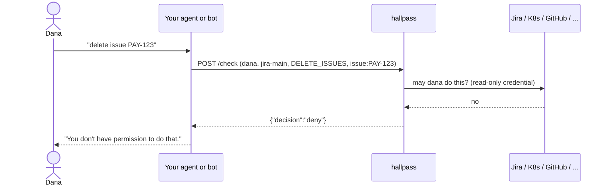

# hallpass

[](https://github.com/roee-hersh/hallpass/actions/workflows/ci.yaml)
[](https://goreportcard.com/report/github.com/roee-hersh/hallpass)
[](LICENSE)

**Permission checks for AI agents and bots, answered live by the system they act in.**


hallpass is a small self-hosted service that answers one question:

> May user X do action Y on resource Z in system C?

Other apps and AI agents act in third-party systems (Jira, GitHub, Kubernetes, ...) with their own
bot credentials, which can usually do more than the person who asked. Before acting, the app asks
hallpass. hallpass asks the third-party system live, with its own read-only credential, and answers
`allow`, `deny` or `unknown`. It only checks. It never performs the action.

## Why

hallpass came out of an ops agent that runs at work. One tool call gives it a service's health from
every angle (error counts, metrics, Kubernetes events, pod restarts, node status) in a few seconds,
so it reads everything, with a read-only account, and nobody gates the reads. It changes things one
way only: by opening a pull request against the GitOps repository. That single write path raised a
question the agent could not answer on its own: may the *person asking* open that pull request in
that repository? The agent's token could, whoever asked. GitHub already knows the answer, so the
agent asks GitHub. hallpass is that question, pulled out of the agent so every write path can use
it, in every system the agent touches.

The general form: an agent or chat bot holds one credential that covers everything anyone uses it
for. When Dana asks it to delete a Jira issue or scale a deployment, the bot can, even when Dana
could not. Copying every system's permission model into your own policy engine drifts out of date
the day you write it. hallpass asks the source of truth instead: Kubernetes `SubjectAccessReview`,
Jira's permission API, GitHub collaborator roles, AWS IAM policy simulation, and so on. One API,
twenty-one systems, no synced copy of anyone's permissions.



- **Read-only.** It only checks and never performs the action.
- **Fails closed.** Anything it cannot evaluate is `unknown`, not `allow`.
- **Single static binary.** One YAML file and one dependency (`yaml.v3`). No database.

## How it differs from OPA, Cedar, OpenFGA and OAuth

| | Where the rules live | What you maintain | Fits |
|---|---|---|---|
| **OPA / Cedar** | Policies you write, over data you feed in | The policy, and a sync of each system's roles into that data | Rules of your own application |
| **OpenFGA / SpiceDB** | A relationship store you write tuples into | The tuples, kept in step with every system | Your own application's object graph |
| **Per-user OAuth** | The system itself, through the user's own token | Every user connecting every system; the agent holding their tokens | Systems that support it, for users who will connect |
| **hallpass** | The system itself, through one read-only credential | One credential per system, nothing to sync | Permissions that already exist in Jira, GitHub, AWS, Kubernetes, ... |

hallpass has no policy language and stores no rules. It asks the system that owns the resource,
at call time, and passes the answer through. Use it next to a policy engine, not instead of one:
OPA or Cedar for the rules of your own product, hallpass for what a person may do in systems you
do not control. Where a system supports acting with the user's own token, prefer that; hallpass
covers the many that do not, and the agents that cannot ask every user to connect every tool.

## Security model

hallpass treats the agent as an **untrusted deputy**: what the agent's own credential can do never
decides anything. The rules, and where each is enforced:

- **The user comes from your session, never from the model.** The caller of `/check` is your agent's
  tool layer, and it passes the user it authenticated (the Slack user, the SSO session). Bind it when
  the tools are built, as the [agent examples](examples/agent/) do; never let the model supply it as a
  tool argument.
- **Checked at the tool gateway.** The check runs in the tool wrapper before the call. The action runs
  only after an `allow`.
- **Fails closed.** `deny`, `unknown`, and any failure to reach hallpass all mean the tool does not
  run. hallpass answers `unknown` whenever it cannot evaluate, and never guesses.
- **Per resource, from the source of truth.** Each check names one resource (`issue:PAY-123`,
  `namespace:payments`) and is answered live by the system that owns it, with a read-only credential.
- **Every decision is logged** as a JSON line: user, connection, action, resource, decision, reason,
  whether it came from the cache, and the evidence: the upstream calls the decision was based on,
  each with its ETag or a hash of the response. See [Decision log](docs/operating.md#decision-log).

Not goals, on purpose:

- **Human approval.** For destructive actions, add a confirmation step in the agent *after* an `allow`.
- **Atomicity.** It is a check before the action, not a transaction; permissions can change in
  between. Answers are cached for 30 seconds by default (`decision_cache_seconds: 0` disables it);
  a check with `"fresh": true` skips the caches and asks the upstream system now, which narrows
  the window but does not close it.
- **Proving who the user is.** hallpass answers "may *this* user…"; authenticating the user is your
  agent's job.

## Install

Download a binary from [Releases](https://github.com/roee-hersh/hallpass/releases), or:

```sh
go install github.com/roee-hersh/hallpass/cmd/hallpass@latest
docker pull ghcr.io/roee-hersh/hallpass:latest
```

## Try it

With Docker, no clone needed:

```sh
curl -sO https://raw.githubusercontent.com/roee-hersh/hallpass/main/examples/hallpass.yaml
docker run --rm -p 8080:8080 -e HALLPASS_API_KEY=change-me \
  -v "$PWD/hallpass.yaml:/etc/hallpass/hallpass.yaml:ro" ghcr.io/roee-hersh/hallpass
```

Or from source:

```sh
export HALLPASS_API_KEY=change-me
go run ./cmd/hallpass validate -config examples/hallpass.yaml
go run ./cmd/hallpass check    -config examples/hallpass.yaml -connection demo \
    -user dana@example.com -action thing.write -resource thing:1
go run ./cmd/hallpass serve    -config examples/hallpass.yaml
```

```sh
curl -X POST localhost:8080/check \
  -H "Authorization: Bearer $HALLPASS_API_KEY" -H 'Content-Type: application/json' \
  -d '{"user":"dana@example.com","connection":"demo","action":"thing.write","resource":"thing:1"}'
```

```json
{"decision":"deny","reason":"denied: dana@example.com is not an admin"}
```

## Use from an AI agent

Wrap any tool that acts for a person so it runs only after hallpass said `allow`. The `guarded`
decorator comes with the client package, [`hallpass-client`](sdk/python) for Python
(standard library only) and [`hallpass-client`](sdk/node) for Node, and a framework's `@tool`
goes straight on top:

```sh
pip install hallpass-client     # or: npm install hallpass-client
```

```python
from contextvars import ContextVar
from hallpass_client import Hallpass, guarded

hp = Hallpass()  # HALLPASS_URL and HALLPASS_API_KEY from the environment
current_user: ContextVar[str] = ContextVar("current_user")  # your app sets it per session

@tool  # LangChain, Strands, MCPServer, ...
@guarded(hp, "jira-main", "DELETE_ISSUES", "issue:{key}", user=current_user)
def delete_issue(key: str) -> str:
    jira.delete_issue(key)  # the agent's own credential
    return f"deleted {key}"
```

`deny`, `unknown`, an unreachable hallpass and a malformed answer all refuse before the body runs.
The user comes from your application, never from the tool's arguments, so the model cannot pick who
it acts as. [docs/agents.md](docs/agents.md) explains the pattern; [`examples/agent`](examples/agent) and
[`examples/agent-ts`](examples/agent-ts) have it working and tested in each framework:

| Framework | Example |
|---|---|
| LangChain | [`langchain_tool.py`](examples/agent/langchain_tool.py) |
| LangGraph | [`langgraph_agent.py`](examples/agent/langgraph_agent.py) |
| Strands Agents | [`strands_tool.py`](examples/agent/strands_tool.py) |
| Claude Agent SDK | [`claude_agent_sdk_tool.py`](examples/agent/claude_agent_sdk_tool.py) |
| MCP, for any host (Claude Code, Claude Desktop, Cursor, ...) | [`mcp_server.py`](examples/agent/mcp_server.py) |
| Vercel AI SDK (TypeScript) | [`ai_sdk_tool.ts`](examples/agent-ts/ai_sdk_tool.ts) |
| MCP TypeScript SDK | [`mcp_server.ts`](examples/agent-ts/mcp_server.ts) |

## API

`POST /check` with a bearer token.

```json
{
  "user": "dana@example.com",
  "groups": ["platform-team"],
  "connection": "k8s-prod-eu",
  "action": "deployment.create",
  "resource": "namespace:payments"
}
```

```json
{ "decision": "allow" | "deny" | "unknown", "reason": "<code>: <text>" }
```

| Case | HTTP | decision | code |
|---|---|---|---|
| Evaluated | 200 | allow / deny | `allowed` / `denied` |
| User has no account in that system | 200 | deny | `user_not_found` |
| Several accounts match the email | 200 | unknown | `user_ambiguous` |
| Upstream timeout, error or rate limit | 200 | unknown | `upstream_timeout`, `upstream_error`, `upstream_rate_limited` |
| hallpass's own credential was rejected | 200 | unknown | `credential_rejected` |
| Resource not visible to hallpass | 200 | unknown | `resource_not_visible` |
| Policy construct hallpass does not understand | 200 | unknown | `unsupported` |
| Bad request, unknown connection or action | 400 | unknown | `invalid_request`, `unknown_connection`, `unknown_action` |
| Bad or missing API key | 401 | unknown | `unauthorized` |

`deny` means the third-party system positively said no. Anything hallpass could not evaluate is
`unknown`. Callers should treat `unknown` as deny.

The request also accepts `"fresh": true`. A fresh check skips every cache for that one request,
the decision cache, the identity cache and the lookups an integration caches itself (role
definitions, policies), and asks the upstream system now; what it learns replaces the cached
entries, so reads keep using the cache. Use it for destructive actions (delete, merge, scale),
where a 30-second-old answer is not good enough, and not for reads: a fresh check costs every
upstream call an uncached check makes (for Argo CD, the policy config maps and the project list;
for Vault, the policies involved; for Snowflake, the grants of every role in the hierarchy).
Lookups that are not permission state are reused for as long as any check reuses them: GitHub's
organization-wide SAML identity listing (the permission read after it is live anyway), AWS
Identity Center's role inventory and permission set names, Salesforce's object and field
describes, and hallpass's own principal name in Databricks. Fresh checks share
a lookup one of them has in flight (an identity, a role's permissions, a policy) and one read
less than a second ago; a fresh answer is one from reads in flight when the caller asked or begun
no more than a second before. Maps hallpass reads from a local file
(`role_map_file`, `user_map_file`) are re-read on their own schedule, not per fresh check. A fresh
check narrows the window between the check and the action to the time between the two; it does
not close it. Closing it needs a conditional write in the upstream system (for example `If-Match`
with an ETag), which only some APIs support. A hallpass built before `fresh` existed rejects a
request that carries it (`invalid_request: unknown field "fresh"`, which the clients report as
`unknown`), so upgrade the service before turning it on in agents.

`GET /healthz` returns `{"status":"ok"}` without authentication.

## Integrations

Twenty-one systems. Two are exercised against the real thing in CI; most validate every request
their tests make against the vendor's published API description; none has yet been confirmed
against a live account beyond those two. The live test (`examples/live-cases.yaml`) is there for
you to run against your own systems before you rely on an integration. Every integration's docs
end with an **Unverified** section naming what has not been confirmed; for the six marked *beta*
that list is long enough that you should read it first.

| Integration | Status | Tests run against |
|---|---|---|
| kubernetes | ready | a real cluster (kind), end to end |
| argocd | ready | the real `argocd` CLI evaluator (differential test) |
| github | ready | fake upstream, requests validated against GitHub's API description |
| gitlab | ready | fake upstream, validated against GitLab's API description |
| bitbucket (Cloud and Data Center) | ready | fake upstream, validated against Bitbucket Cloud's API description |
| jira (Cloud) | ready | fake upstream, validated against Jira's API description |
| confluence (Cloud) | ready | fake upstream, validated against Confluence's API descriptions |
| slack | ready | fake upstream, validated against Slack's API description |
| datadog | ready | fake upstream, validated against Datadog's API descriptions |
| pagerduty | ready | fake upstream, validated against PagerDuty's API description |
| aws | ready | fake upstream, validated against the IAM, STS and Identity Center service models |
| googleworkspace | ready | fake upstream, validated against the Google API discovery documents |
| googlecloud | ready | fake upstream, validated against the Policy Troubleshooter discovery document |
| microsoft365 | ready | fake upstream, validated against the Microsoft Graph API description |
| databricks | ready | fake upstream only |
| salesforce | beta | fake upstream only; see **Unverified** in its docs |
| snowflake | beta | fake upstream, validated against the SQL API description; see **Unverified** |
| vault | beta | fake upstream, validated against Vault's API description; see **Unverified** |
| azure | beta | fake upstream, validated against the Azure authorization API descriptions; see **Unverified** |
| linear | beta | fake upstream, validated against Linear's GraphQL schema; see **Unverified** |
| zendesk | beta | fake upstream, validated against Zendesk's API description; see **Unverified** |
| fake | for smoke tests | |

Each integration is documented in `docs/integrations/<name>.md`: the credential to create, the
minimum permissions it needs, the actions and resources, and what it cannot see.

## Running it for real

- [docs/operating.md](docs/operating.md): the configuration file (`hallpass.yaml`, credentials as
  `env:`/`file:` references, timeouts, caches), the `serve`, `validate`, `probe`, `check` and
  `catalog` commands, the container image, the Helm chart, the decision log and the design notes.
- [docs/testing.md](docs/testing.md): the unit, spec-validated, contract, end-to-end, differential,
  live and fuzz tests, and how to run each.
- [docs/integrations/](docs/integrations/): one page per integration with the credential to create,
  the minimum permissions, the actions and resources, and what it cannot see.

## License

Apache-2.0.

## Contributing

Issues and pull requests are welcome, especially new integrations. See
[CONTRIBUTING.md](CONTRIBUTING.md). Report security issues privately as described in
[SECURITY.md](SECURITY.md).

Much of this code was written with Claude Code, directed and reviewed by the maintainer. That is
why the tests are the bar rather than the author: every integration ships with a fake of its API
that validates each request against the vendor's description, injects failures, and asserts that
no secret reaches a log line; the security model above is enforced by those tests, not by trust.
Contributions written the same way are welcome on the same terms.
