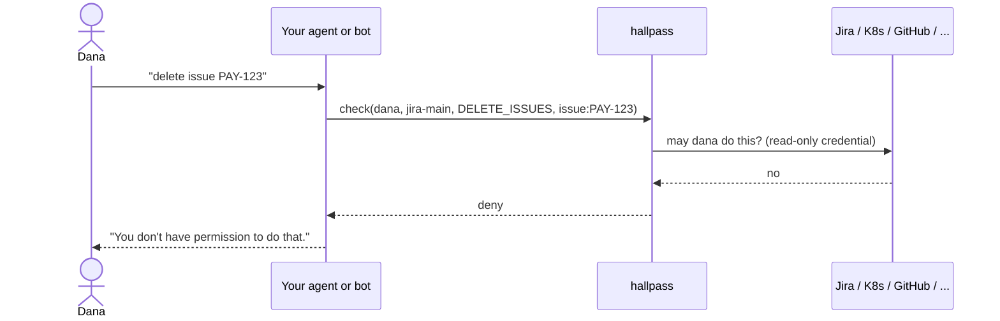

# hallpass

[](https://github.com/roee-hersh/hallpass/actions/workflows/ci.yaml)
[](LICENSE)

**Permission checks for AI agents and bots, answered live by the system they act in.**


hallpass is a small Python package that answers one question, in your agent's process or as a
self-hosted service:

> May user X do action Y on resource Z in system C?

Other apps and AI agents act in third-party systems (Jira, GitHub, Kubernetes, ...) with their own
bot credentials, which can usually do more than the person who asked. Before acting, the app asks
hallpass. hallpass asks the third-party system live, with its own read-only credential, and answers
`allow`, `deny` or `unknown`. It only checks. It never performs the action.

## Why

hallpass came out of an ops agent that runs at work. One tool call gives it a service's health from
every angle (error counts, metrics, Kubernetes events, pod restarts, node status) in a few seconds,
so it reads everything, with a read-only account, and nobody gates the reads. It changes things one
way only: by opening a pull request against the GitOps repository. That single write path raised a
question the agent could not answer on its own: may the *person asking* open that pull request in
that repository? The agent's token could, whoever asked. GitHub already knows the answer, so the
agent asks GitHub. hallpass is that question, pulled out of the agent so every write path can use
it, in every system the agent touches.

The general form: an agent or chat bot holds one credential that covers everything anyone uses it
for. When Dana asks it to delete a Jira issue or scale a deployment, the bot can, even when Dana
could not. Copying every system's permission model into your own policy engine drifts out of date
the day you write it. hallpass asks the source of truth instead: Kubernetes `SubjectAccessReview`,
Jira's permission API, GitHub collaborator roles, AWS IAM policy simulation, and so on. One API,
twenty-one systems, no synced copy of anyone's permissions.



- **Read-only.** It only checks and never performs the action.
- **Fails closed.** Anything it cannot evaluate is `unknown`, not `allow`.
- **One Python package, in-process or as a server.** `pip install hallpass` runs the checks inside
  your agent; `hallpass serve` runs the same engine as an HTTP service. The core depends only on
  PyYAML. One YAML file, no database.

## How it differs from OPA, Cedar, OpenFGA and OAuth

| | Where the rules live | What you maintain | Fits |
|---|---|---|---|
| **OPA / Cedar** | Policies you write, over data you feed in | The policy, and a sync of each system's roles into that data | Rules of your own application |
| **OpenFGA / SpiceDB** | A relationship store you write tuples into | The tuples, kept in step with every system | Your own application's object graph |
| **Per-user OAuth** | The system itself, through the user's own token | Every user connecting every system; the agent holding their tokens | Systems that support it, for users who will connect |
| **hallpass** | The system itself, through one lookup credential | One credential per system, nothing to sync | Permissions that already exist in Jira, GitHub, AWS, Kubernetes, ... |

hallpass has no policy language and stores no rules. It asks the system that owns the resource,
at call time, and passes the answer through. Use it next to a policy engine, not instead of one:
OPA or Cedar for the rules of your own product, hallpass for what a person may do in systems you
do not control. Where a system supports acting with the user's own token, prefer that; hallpass
covers the many that do not, and the agents that cannot ask every user to connect every tool.

## Security model

- **The agent is an untrusted deputy.** What its own credential can do never decides anything.
- **The user comes from your session, never from the model.** The tool layer passes the user it
  authenticated; `guarded` binds it when the tool is built.
- **Fails closed.** `deny`, `unknown` and an unreachable hallpass all mean the tool does not run.
- **Read-only, per resource, from the source of truth.** Each check is answered live by the system
  that owns the resource, with a credential that is read-only wherever the product allows it.
- **The lookup credentials can stay out of the agent.** The agent keeps its own credential to act.
  Asking what *another* user may do takes different, more sensitive access: it reveals what anyone
  may do, and in Jira it needs Administer Jira. In-process, the agent's process holds those
  credentials. Run hallpass as a server in its own container or service, with the credentials
  mounted only there, and the agent's process never holds them.
- **Every decision is logged** as a JSON line, with the upstream calls it was based on.

Not goals: approving changes, making check and action atomic, or proving who the user is.
[Architecture](docs/concepts/architecture.md) explains each boundary.

## Quickstart

```sh
pip install hallpass
curl -sO https://raw.githubusercontent.com/roee-hersh/hallpass/main/examples/hallpass.yaml
```

The example config has a `demo` connection that talks to nothing. Ask it, in-process:

```python
from hallpass import Hallpass

hp = Hallpass.from_config("hallpass.yaml")
d = hp.check("dana@example.com", "demo", "thing.write", "thing:1")
print(d.decision, d.reason)  # deny denied: dana@example.com is not an admin
```

Then guard a tool, so it runs only after hallpass said `allow`:

```python
from contextvars import ContextVar
from hallpass import guarded

current_user: ContextVar[str] = ContextVar("current_user")  # your app sets it per session

@tool  # LangChain, Strands, MCPServer, ...
@guarded(hp, "jira-main", "DELETE_ISSUES", "issue:{key}", user=current_user)
def delete_issue(key: str) -> str:
    jira.delete_issue(key)  # the agent's own credential, only after allow
    return f"deleted {key}"
```

To keep the lookup credentials out of the agent, run the same engine as a server:

```sh
docker run --rm -p 8080:8080 -e HALLPASS_API_KEY=change-me \
  -v "$PWD/hallpass.yaml:/etc/hallpass/hallpass.yaml:ro" ghcr.io/roee-hersh/hallpass
```

```sh
curl -X POST localhost:8080/check -H 'Authorization: Bearer change-me' \
  -d '{"user":"dana@example.com","connection":"demo","action":"thing.write","resource":"thing:1"}'
```

```json
{"decision":"deny","reason":"denied: dana@example.com is not an admin"}
```

and change one line in the agent: `hp = Hallpass.remote("http://localhost:8080", api_key)`. The
methods and `guarded` are the same. From Node, `npm install hallpass-client` talks to the server.

The [quickstart](docs/quickstart.md) walks through all of it, including connecting a real system.
Each framework has an adapter that checks every tool call with a rule, configured once on the
agent, and a working example:

| Framework | Adapter | Example |
|---|---|---|
| Strands Agents | `hallpass.strands.HallpassAuthorization` | [`strands_agent.py`](hallpass-py/examples/strands_agent.py) |
| LangChain, LangGraph | `hallpass.langchain.HallpassMiddleware` | [`langchain_agent.py`](hallpass-py/examples/langchain_agent.py) |
| MCP servers (`mcp` SDK), for any host | `hallpass.mcp.guard` | [`mcp_server.py`](hallpass-py/examples/mcp_server.py) |
| OpenAI Agents SDK | `hallpass.openai_agents.HallpassGuardrails` | [`openai_agents_agent.py`](hallpass-py/examples/openai_agents_agent.py) |
| Claude Agent SDK | `hallpass.claude_agent_sdk.HallpassHooks` | [`claude_agent_sdk_agent.py`](hallpass-py/examples/claude_agent_sdk_agent.py) |
| Google ADK | `hallpass.google_adk.HallpassCallbacks` | [`google_adk_agent.py`](hallpass-py/examples/google_adk_agent.py) |
| CrewAI | `hallpass.crewai.HallpassHooks` | [`crewai_agent.py`](hallpass-py/examples/crewai_agent.py) |
| Pydantic AI | `hallpass.pydantic_ai.HallpassAuthorization` | [`pydantic_ai_agent.py`](hallpass-py/examples/pydantic_ai_agent.py) |
| LlamaIndex | `hallpass.llamaindex.HallpassAuthorization` | [`llamaindex_agent.py`](hallpass-py/examples/llamaindex_agent.py) |
| Vercel AI SDK (TypeScript) | `guarded` from `hallpass-client` | [`ai_sdk_tool.ts`](examples/agent-ts/ai_sdk_tool.ts) |
| MCP TypeScript SDK | `guarded` from `hallpass-client` | [`mcp_server.ts`](examples/agent-ts/mcp_server.ts) |

## Integrations

Kubernetes, Argo CD, GitHub, GitLab, Bitbucket, Jira, Confluence, Slack, Datadog, PagerDuty, AWS,
Google Workspace, Google Cloud, Microsoft 365, Databricks, Salesforce, Snowflake, Vault, Azure,
Linear and Zendesk. Kubernetes and Argo CD are tested against the real thing in CI; the rest
against the vendors' published API descriptions, and six are marked beta.
[The integrations page](docs/integrations/README.md) has the status of each and one page per system.

## Documentation

| | |
|---|---|
| [Quickstart](docs/quickstart.md) | Run it, ask a question, guard a tool |
| [Architecture](docs/concepts/architecture.md) | How a check flows, caching, trust boundaries |
| [Deploy](docs/guides/deploy.md) | In-process or a server: Docker, pip, Kubernetes with Helm, TLS, production checklist |
| [Add hallpass to your agent](docs/guides/agent-tools.md) | Which tools to guard, where the user comes from, per framework |
| [Operating](docs/guides/operating.md) | Decision log, health, what each `unknown` means |
| [Python API](docs/reference/client.md), [HTTP API](docs/reference/api.md), [configuration](docs/reference/configuration.md), [CLI](docs/reference/cli.md) | Reference |
| [All docs](docs/README.md) | The full index |

## License

Apache-2.0.

## Contributing

Issues and pull requests are welcome, especially new integrations. See
[CONTRIBUTING.md](CONTRIBUTING.md). Report security issues privately as described in
[SECURITY.md](SECURITY.md).

Much of this code was written with Claude Code, directed and reviewed by the maintainer. That is
why the tests are the bar rather than the author: every integration ships with a fake of its API
that validates each request against the vendor's description, injects failures, and asserts that
no secret reaches a log line; the security model above is enforced by those tests, not by trust.
Contributions written the same way are welcome on the same terms.
