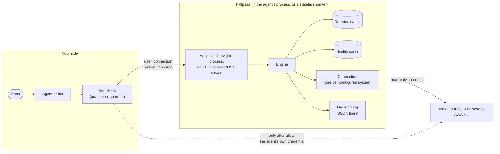

# Architecture

How hallpass answers a question, what it keeps, and where the trust boundaries are. For running it,
see [Deploy](../guides/deploy.md); for the fields and codes, the [API reference](../reference/api.md).

## The shape of it



Three parties, three credentials:

| Party | Holds | Can |
|---|---|---|
| Your agent | its own credential for each system, plus the hallpass API key (server) | act in the systems, and ask hallpass |
| hallpass | one **read-only** credential per connection | read who may do what; never act |
| The user | nothing hallpass sees | talk to the agent |

hallpass is one Python package, `hallpass`, with one dependency (PyYAML). Its HTTP client, HTTP
server and request signing are its own, on the standard library; only signing with an RSA private
key needs `cryptography` (the `crypto` extra). The same engine runs in two places:

- **In-process**: `Hallpass.from_config(path)` or `Hallpass(connections=[...])` builds the engine
  inside your agent. No service, no API key; the agent's process holds the lookup credentials.
- **As a server**: `hallpass serve` (the Docker image, the Helm chart) puts the engine behind
  `POST /check`. Agents ask it with `Hallpass.remote(url, api_key)`, the Node client or any HTTP
  client, and hold only the API key.

It has no database: the configuration (a file, or the same keys in code) is the only input, and
everything it remembers is a short-lived cache in memory.

## Vocabulary

- **Integration**: a product hallpass knows how to ask, such as `jira` or `kubernetes`. There are
  [twenty-one](../integrations/README.md).
- **Connection**: one configured system of an integration, such as one Jira site or one cluster,
  with an `id` callers use (`jira-main`, `k8s-prod-eu`).
- **Action**: what the caller asks about, named in the integration's own terms (`DELETE_ISSUES`,
  `repo.push`, `deployment.create`). `hallpass catalog <integration>` lists them.
- **Resource**: what the action is on, as `type:id` (`issue:PAY-123`, `repo:acme/api@main`,
  `namespace:payments?resource=deployments.apps`).

## One check, step by step

In-process, the tool check calls the engine directly, without the server; from the engine on, it
is the same code path. Paths are under `hallpass-py/src/`.

```mermaid
sequenceDiagram
    participant T as Tool check
    participant S as Server
    participant E as Engine
    participant C as Connection
    participant X as Upstream system
    T->>S: POST /check (Bearer key)
    S->>S: constant-time key check, 64 KiB limit, strict JSON
    S->>E: request
    E->>E: validate user, groups, action name, resource
    E->>E: decision cache hit? (allow/deny only, unless fresh)
    E->>C: resolve_identity(email, groups) (identity cache)
    C->>X: find the account for this email
    E->>C: check(identity, action, resource) under the connection timeout
    C->>X: ask the system's permission API
    X-->>C: answer
    C-->>E: allow / deny / error
    E->>E: error → unknown; cache allow and deny
    E->>E: write one decision-log line with evidence
    E-->>S: decision + HTTP status
    S-->>T: {"decision": ..., "reason": "<code>: <text>"}
```

1. **Server** (`hallpass/server.py`, server only). Accepts `POST /check` with a bearer API key
   compared in constant time, reads at most 64 KiB, and rejects unknown JSON fields. `GET /healthz`
   is the only unauthenticated route.
2. **Engine** (`hallpass/core/engine.py`). Validates the request (an email of at most 320 bytes, at most
   200 groups, no control characters), finds the connection and the action, and consults the
   decision cache.
3. **Identity resolution**. Each integration maps the caller's email to its own account: a SAML
   identity lookup, a user search, a login template limited to your email domains, or a mapping
   file, depending on the integration and your configuration. No account gives `deny` with
   `user_not_found`. More than one match gives `unknown` with `user_ambiguous`.
4. **Check**. The connection asks the system's own permission API: `SubjectAccessReview` for
   Kubernetes, the permissions endpoint for Jira, the collaborator permission for GitHub, IAM policy
   simulation for AWS, and so on. Every call goes through hallpass's own HTTP client with no vendor
   SDK. Every call is bounded by the connection's `timeout`, verifies TLS, and is recorded as
   evidence.
5. **Decision**. An integration returns `deny` only when the system positively said no. Every
   error, timeout, rate limit, rejected credential or construct hallpass does not understand becomes
   `unknown`. `allow` and `deny` are cached. `unknown` never is.
6. **Decision log** (`hallpass/core/declog.py`). One JSON line per answered check, with the upstream calls
   it was based on. See [Decision log](../guides/operating.md#decision-log).

## Three answers

| Answer | Meaning | What the caller does |
|---|---|---|
| `allow` | The system said this user may | Act, with the agent's own credential |
| `deny` | The system said this user may not, or the user has no account there | Refuse, and tell the user why |
| `unknown` | hallpass could not find out | Refuse. Treat it exactly like `deny` |

`unknown` is a separate answer, not a flavour of deny, so that operators can tell "Dana may not"
apart from "Jira timed out" in the log and in alerts. Agents must not act on it. `require`,
`guarded`, the framework adapters and the [Node client](../reference/client.md) refuse on anything
but `allow`, including a hallpass server they cannot reach.

## What it remembers

Nothing durable. In memory, per process (per `Hallpass` object in-process):

| Cache | Default | Keyed on | Notes |
|---|---|---|---|
| Decisions | 30 s (`decision_cache_seconds`) | connection, user, groups, action, resource | `allow` and `deny` only |
| Identities | 900 s (`identity_cache_seconds`) | connection, user, groups | the email-to-account mapping |
| Integration lookups | per integration | role definitions, policies, project lists | listed in each integration's page |

A request with `"fresh": true` skips all three for itself and refreshes what it reads. Use it for
destructive actions. It narrows the gap between the check and the action but cannot close it; see
the [API reference](../reference/api.md#fresh-checks).

Because no state is shared, you can run as many server replicas, or agent processes with the
engine in-process, as you like. Each keeps its own caches, which multiplies upstream calls on a
cold start but never changes an answer.

## Trust boundaries

hallpass treats the agent as an **untrusted deputy**: what the agent's own credential can do never
decides anything.

- **Whoever calls names the user.** hallpass answers "may *this* user…". It does not
  authenticate the user. Your agent's tool layer does, and passes the user from its session (the
  Slack user, the SSO login), never from anything the model wrote. The
  [agent guide](../guides/agent-tools.md#3-set-the-user-from-your-login-not-from-the-model) shows how. In-process, that is
  the code that calls `check`; with a server, whoever holds the API key, so give the key only to
  that tool layer.
- **The model never chooses the user.** `guarded` binds the user when the tool is built, and a
  `user` field in the tool's arguments is ignored. The framework adapters read the user from
  something the application sets (invocation state, the runtime context, the session, an access
  token), never from the tool's input.
- **hallpass's own credentials are read-only** wherever the product allows it. Each
  [integration page](../integrations/README.md) says exactly what to grant, and where a product forces
  a broader grant.
- **The lookup credentials stay out of the agent, when hallpass runs as a server.** The agent
  needs its own credential to act. hallpass does not take that credential away and cannot stop
  agent code that skips the check: the
  check guards against the model choosing to act, not against a compromised agent. What a separate
  hallpass keeps out of the agent is the credential that answers for other users. That access is
  different and more sensitive than acting: it reveals what anyone may do (a `SubjectAccessReview`
  about any user, IAM policy simulation), and in Jira it needs Administer Jira. Run hallpass in its
  own container or as a shared service, with its credentials mounted only there. The in-process
  engine, or a hallpass process on the agent's host under the agent's own user, gives that up: use
  it where the agent may hold those credentials, such as a trusted internal bot, or for development.
- **Secrets never sit in the config.** Every credential is an `env:NAME` or `file:/path` reference,
  and files are re-read on every use, so a rotated token keeps working. Connections given in code
  take `hallpass.env()`, `hallpass.file()` or, for a value your code already holds,
  `hallpass.literal()`. Secrets are redacted in logs. Request and response bodies of upstream calls
  are never logged.
- **Upstream URLs must be `https://`**, with plain `http://` only for localhost. TLS verification
  cannot be turned off; `ca_file` adds a private CA instead.

## What it deliberately does not do

- **Act.** It never performs the action. Its credentials are read-only wherever the product allows
  it; where one does not (Jira's permission check needs Administer Jira), the
  [integration page](../integrations/README.md) says so.
- **Approve.** Whether an allowed change *should* happen (at 3 a.m., without review) is a separate
  decision. Add a confirmation step in the agent after an `allow`.
- **Make check and action atomic.** Permissions can change in between. A `fresh` check narrows the
  window. Only a conditional write in the upstream system, such as `If-Match`, closes it.
- **Hold a policy language.** It stores no rules. It passes the system's own answer through. Use
  OPA or Cedar for the rules of your own product, next to it.

## Code map

Under `hallpass-py/src/hallpass/`:

| Module | Role |
|---|---|
| `_api.py` | `Hallpass` (in-process and remote), `Decision`, `PermissionDenied`, `guarded` |
| `_rules.py` | the rule and decision flow every framework adapter shares |
| `strands.py`, `langchain.py`, `mcp.py`, `openai_agents.py`, `claude_agent_sdk.py`, `google_adk.py`, `crewai.py`, `pydantic_ai.py`, `llamaindex.py` | the framework adapters |
| `cli.py` | the `serve`, `validate`, `probe`, `check` and `catalog` commands |
| `server.py` | HTTP handlers, API key, request parsing |
| `core/engine.py` | the check flow, validation, caches |
| `core/config.py` | the loader: strict keys, line numbers in errors, secret references |
| `core/integration.py` | the classes every integration implements, and the registry |
| `integrations/<name>/` | one package per integration; `integrations/__init__.py` lists them |
| `net/httpx.py` | the shared HTTP client: TLS, proxies, timeouts, evidence recording |
| `authx/` | OAuth2, JWT, AWS SigV4 and Google service-account signing |
| `core/cache.py` | the single-flight TTL cache |
| `core/declog.py`, `core/evidence.py` | the decision log and its evidence |
| `core/secret.py` | `env:` and `file:` references, redaction |

Writing a new integration: [integration-authoring.md](../development/integration-authoring.md).
