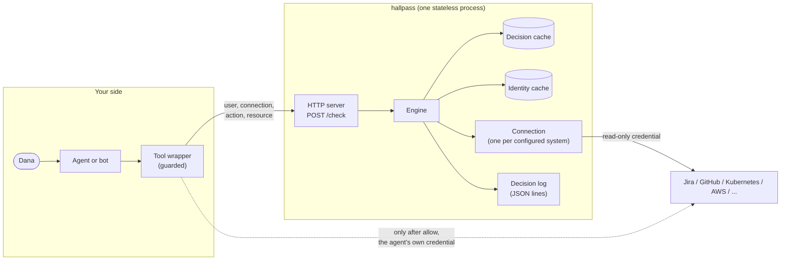

# Architecture

How hallpass answers a question, what it keeps, and where the trust boundaries are. For running it,
see [Deploy](../guides/deploy.md); for the fields and codes, the [API reference](../reference/api.md).

## The shape of it



Three parties, three credentials:

| Party | Holds | Can |
|---|---|---|
| Your agent | its own credential for each system, plus the hallpass API key | act in the systems, and ask hallpass |
| hallpass | one **read-only** credential per connection | read who may do what; never act |
| The user | nothing hallpass sees | talk to the agent |

hallpass is a single Go binary with one dependency (`gopkg.in/yaml.v3`). It has no database: the
configuration file is the only input, and everything it remembers is a short-lived cache in memory.

## Vocabulary

- **Integration**: a product hallpass knows how to ask, such as `jira` or `kubernetes`. There are
  [twenty-one](../integrations/README.md).
- **Connection**: one configured system of an integration, such as one Jira site or one cluster,
  with an `id` callers use (`jira-main`, `k8s-prod-eu`).
- **Action**: what the caller asks about, named in the integration's own terms (`DELETE_ISSUES`,
  `repo.push`, `deployment.create`). `hallpass catalog <integration>` lists them.
- **Resource**: what the action is on, as `type:id` (`issue:PAY-123`, `repo:acme/api@main`,
  `namespace:payments?resource=deployments.apps`).

## One check, step by step

```mermaid
sequenceDiagram
    participant T as Tool wrapper
    participant S as Server
    participant E as Engine
    participant C as Connection
    participant X as Upstream system
    T->>S: POST /check (Bearer key)
    S->>S: constant-time key check, 64 KiB limit, strict JSON
    S->>E: request
    E->>E: validate user, groups, action name, resource
    E->>E: decision cache hit? (allow/deny only, unless fresh)
    E->>C: ResolveIdentity(email, groups) (identity cache)
    C->>X: find the account for this email
    E->>C: Check(identity, action, resource) under the connection timeout
    C->>X: ask the system's permission API
    X-->>C: answer
    C-->>E: allow / deny / error
    E->>E: error → unknown; cache allow and deny
    E->>E: write one decision-log line with evidence
    E-->>S: decision + HTTP status
    S-->>T: {"decision": ..., "reason": "<code>: <text>"}
```

1. **Server** (`internal/server`). Accepts `POST /check` with a bearer API key compared in constant
   time, reads at most 64 KiB, and rejects unknown JSON fields. `GET /healthz` is the only
   unauthenticated route.
2. **Engine** (`internal/engine`). Validates the request (an email of at most 320 bytes, at most
   200 groups, no control characters), finds the connection and the action, and consults the
   decision cache.
3. **Identity resolution**. Each integration maps the caller's email to its own account: a SAML
   identity lookup, a user search, a login template limited to your email domains, or a mapping
   file, depending on the integration and your configuration. No account gives `deny` with
   `user_not_found`. More than one match gives `unknown` with `user_ambiguous`.
4. **Check**. The connection asks the system's own permission API: `SubjectAccessReview` for
   Kubernetes, the permissions endpoint for Jira, the collaborator permission for GitHub, IAM policy
   simulation for AWS, and so on. Every call is plain `net/http` with no vendor SDK. Every call is
   bounded by the connection's `timeout`, verifies TLS, and is recorded as evidence.
5. **Decision**. An integration returns `deny` only when the system positively said no. Every
   error, timeout, rate limit, rejected credential or construct hallpass does not understand becomes
   `unknown`. `allow` and `deny` are cached. `unknown` never is.
6. **Decision log** (`internal/declog`). One JSON line per answered check, with the upstream calls
   it was based on. See [Decision log](../guides/operating.md#decision-log).

## Three answers

| Answer | Meaning | What the caller does |
|---|---|---|
| `allow` | The system said this user may | Act, with the agent's own credential |
| `deny` | The system said this user may not, or the user has no account there | Refuse, and tell the user why |
| `unknown` | hallpass could not find out | Refuse. Treat it exactly like `deny` |

`unknown` is a separate answer, not a flavour of deny, so that operators can tell "Dana may not"
apart from "Jira timed out" in the log and in alerts. Agents must not act on it. The
[client libraries](../../sdk) refuse on anything but `allow`, including a hallpass they cannot reach.

## What it remembers

Nothing durable. In memory, per process:

| Cache | Default | Keyed on | Notes |
|---|---|---|---|
| Decisions | 30 s (`decision_cache_seconds`) | connection, user, groups, action, resource | `allow` and `deny` only |
| Identities | 900 s (`identity_cache_seconds`) | connection, user, groups | the email-to-account mapping |
| Integration lookups | per integration | role definitions, policies, project lists | listed in each integration's page |

A request with `"fresh": true` skips all three for itself and refreshes what it reads. Use it for
destructive actions. It narrows the gap between the check and the action but cannot close it; see
the [API reference](../reference/api.md#fresh-checks).

Because no state is shared, you can run as many replicas as you like. Each keeps its own caches,
which multiplies upstream calls on a cold start but never changes an answer.

## Trust boundaries

hallpass treats the agent as an **untrusted deputy**: what the agent's own credential can do never
decides anything.

- **Whoever holds the API key names the user.** hallpass answers "may *this* user…". It does not
  authenticate the user. Your agent's tool layer does, and passes the user from its session (the
  Slack user, the SSO login), never from anything the model wrote. The
  [agents guide](../guides/agent-tools.md#where-the-user-comes-from) shows how. Give the API key only to that tool
  layer.
- **The model never chooses the user.** `guarded` binds the user when the tool is built, and a
  `user` field in the tool's arguments is ignored.
- **hallpass's own credentials are read-only** wherever the product allows it. Each
  [integration page](../integrations/README.md) says exactly what to grant, and where a product forces
  a broader grant.
- **Secrets never sit in the config.** Every credential is an `env:NAME` or `file:/path` reference,
  and files are re-read on every use, so a rotated token keeps working. Secrets are redacted in
  logs. Request and response bodies of upstream calls are never logged.
- **Upstream URLs must be `https://`**, with plain `http://` only for localhost. TLS verification
  cannot be turned off; `ca_file` adds a private CA instead.

## What it deliberately does not do

- **Act.** It never performs the action and holds no credential that could.
- **Approve.** Whether an allowed change *should* happen (at 3 a.m., without review) is a separate
  decision. Add a confirmation step in the agent after an `allow`.
- **Make check and action atomic.** Permissions can change in between. A `fresh` check narrows the
  window. Only a conditional write in the upstream system, such as `If-Match`, closes it.
- **Hold a policy language.** It stores no rules. It passes the system's own answer through. Use
  OPA or Cedar for the rules of your own product, next to it.

## Code map

| Package | Role |
|---|---|
| `cmd/hallpass` | the `serve`, `validate`, `probe`, `check` and `catalog` commands |
| `internal/server` | HTTP handlers, API key, request parsing |
| `internal/engine` | the check flow, validation, caches |
| `internal/config` | the YAML loader: strict keys, line numbers in errors, secret references |
| `internal/integration` | the interface every integration implements |
| `internal/integrations/<name>` | one package per integration |
| `internal/httpx` | the shared HTTP client: TLS, proxies, timeouts, evidence recording |
| `internal/authx` | OAuth2, JWT, AWS SigV4 and Google service-account signing |
| `internal/cache` | the single-flight TTL cache |
| `internal/declog`, `internal/evidence` | the decision log and its evidence |
| `internal/secret` | `env:` and `file:` references, redaction |

Writing a new integration: [integration-authoring.md](../development/integration-authoring.md).
